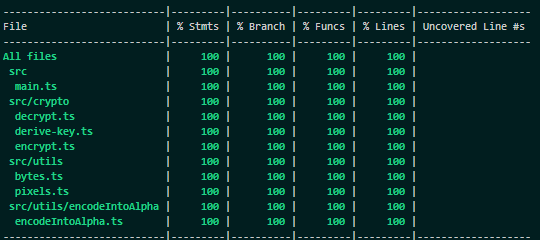

# 🚀 Typescript NPM Library Template

## Features

| Tool                                                                                                                             | Description                                       |
| -------------------------------------------------------------------------------------------------------------------------------- | ------------------------------------------------- |
|  | Typescript                                        |
|                                                    | Vitest                                            |
|                 | Code Linting                                      |
| 🐶                                                                                                                               | Pre-commit Hooks                                  |
|                      | Releasing versions to NPM                         |
|                                        | Consistent coding styles across different editors |
|                                                    | Code Formatting                                   |
|                                              | Module bundler for JavaScript                     |

## Getting Started

1. Create a new repository using this one as template

2. Create 2 core branches: `dev` and `main`.

   2.1 `dev` will serve all your versions.

   2.2 new additions should be pushed to `main` when they have been approved/tested appropriately.

3. Clone your repo
4. Install dependencies with `npm install`
5. Run `npm run prepare` command to setup [Husky](https://typicode.github.io/husky) pre-commit hooks.

### Main Scripts

Always prepending yarn:

- `build`: Builds the static storybook project.
- `lint:fix`: Applies linting based on the rules defined in **.eslintrc.js**.
- `format:prettier`: Formats files using the prettier rules defined in **.prettierrc**.
- `test`: Runs testing using watch mode.
- `test:cov`: Runs testing displaying a coverage report.

### Publishing the Library to NPM

**Using Github as the hosting service:**

1. Check the `Allow GitHub Actions to create and approve pull requests` box under the Settings>Code and automation>Actions>General repository configuration. This will allow the release-please workflow to create a PR increasing the version.
2. Create a repository secret called `NPM_TOKEN` under Settings>Security>Secrets and variables>Actions for the github action to be able to publish the library to npm.

With these 2 requirements, Pull Requests raised by release-please will have enough permissions. For more details, check the [official documentation](https://github.com/google-github-actions/release-please-action).

### Versioning

Following [Conventional Commits](https://www.conventionalcommits.org/).

**release-please** will bump a patch version if new commits are only fixes.

It will bump a minor version if new commits include a _feat_.

`feat!`, `fix!`, `refactor!`, etc., which represent a breaking change, will result in a major version.

In order to change the version manually (i.e. force it), a new commit has to be created including `Release-As: X.X.X` as the description.
Example: `git commit -m "chore: v1.2.0" -m "Release-As: 1.2.0"`

## Author

## Testing

## License

[MIT](LICENSE)

## Support

If you find this library helpful, consider buying me a coffee to show your support!

